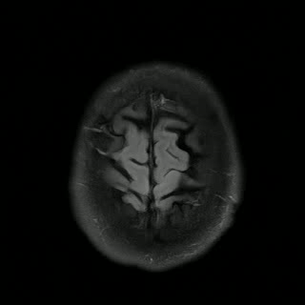

# Autoregressive image diffusion: generation of image sequences and application in MRI reconstruction

This is the codebase for [Autoregressive Image Diffusion (AID)](https://arxiv.org/abs/2405.14327), which is built upon [openai/guided-diffusion](https://github.com/openai/guided-diffusion)
with modifications for the training and sampling of autoregressive image diffusion models and its application to MRI reconstruction.

The [Causal-Unet](guided_diffusion/unet2.py) is implemented upon the original Unet architecture to allow for autoregressive mechanisms imposed on image sequences. In [gaussian_diffusion.py](guided_diffusion/gaussian_diffusion.py), we added function `training_losses_temporal` for training AID models to exploit dependencies in image sequences and some other relevant modifications, and we added function `p_sample_temporal_loop` for sampling image sequences prospectively and some other relevant modifications.

## Sequential samples from models trained on different datasets

<table>
  <tr>
    <td>
        FastMRI 2D multi-slices
    </td>
    <td>
        Cardiac Cine
    </td>
    <td>
       ABIDE 3D volume
    </td>
  </tr>
  <tr>
    <td>
        
    </td>
    <td>
      
    </td>
    <td>
      
    </td>
  </tr>
</table>

## Installation
```sh
git clone https://github.com/mrirecon/aid.git
cd aid
pip install -e .
```

## Run examples
```sh
cd scripts
bash examples.sh
python viewer.py logs/example_xxx/sample
```
The results will be saved in `scripts/logs/example_xxx`, where `xxx` denotes the experiment name. Please use the `viewer.py` to visualize the samples. It take around 3 hours to complete the following five tasks in the `examples.sh`.

* `download_pretrained`: Downloads pretrained models and sample data necessary for reconstruction and sampling.
* `unfolding`: Performs MRI unfolding using pretrained models to generate high-resolution images using `sample.py`. 
* `reconstruction`: Conducts volume reconstruction of MRI images using pretrained models using `fastmri_recon.py`.
* `sampling_brain`: Generates sample MRI images using pretrained models using `sample.py`.
* `sampling_cardiac`: Generates sample cardiac cine images using pretrained models using `sample.py`.

### Retrospective samples

### Prospective samples (warmstart)

### Prospective samples (coldstart)

### Reconstruction of MRI images


## Training models

The [`CustomDataLoader`](scripts/utils.py) and [`CustomDataset`](scripts/utils.py) classes are implemented for loading image sequences for training without breaking the order of the sequences. The function [`load_data`](scripts/utils.py) returns a `DataLoader` object that can be used for training. Please refer to the [`datasets/README.md`](datasets/README.md) for instructions on preparing datasets for training. Update the script [`train.sh`](scripts/train.sh) variables according to your environment:
- `logdir`: Directory to save logs and checkpoints.
- `expname`: Experiment name for logging and checkpoint saving.
- `datadir`: Directory containing the dataset.
- `image_size`: Size of the images.

### Running the Training Stages

Perform two-stage training manually using the two functions: `first_stage` and `second_stage`, in the script [`train.sh`](scripts/train.sh). The `second_stage` function resumes training from the first stage checkpoint and only trains the temporal-spatial conditioning block. The `--resume_checkpoint` flag can be used to resume training from a checkpoint.
The `one_stage` function is a combined training stage with a different configuration suitable for single-stage training.

## Miscellaneous
We provided the binary file for BART reconstruction toolbox on this [link](https://huggingface.co/Guanxiong/MRI-Image-Priors/tree/main/Data). If it doesn't work on your local system, please clone the [BART repository](https://github.com/mrirecon/bart) and compile it on your local system.

We provided a latent space model for cardiac cine image generation, in which the VQVAE model is trained on the cardiac cine dataset using the code in this repository [`taming-transformers`](https://github.com/CompVis/taming-transformers.git). Please install it when you want to generate cardiac cine images.

We provided [`recon_all.sh`](scripts/recon_all.sh) for performing MRI reconstruction of the validation data in the fastMRI dataset on HPC cluster. This script will submit a job for each of the validation data. The job contains many tasks that are defined in [`recon_func.sh`](scripts/recon_func.sh). The script [`recon_func.sh`](scripts/recon_func.sh) will perform reconstruction experiments using the pretrained models and save the results in the specified directory. If you are interested in running the script, please update the variables in the script according to your environment.

We provided [`image_train.py`](scripts/image_train.py) for training the normal image diffusion model. The command to use it is included in [`train.sh`](scripts/train.sh).

## Contact
If you have any questions, please contact Guanxiong Luo (luoguan5@gmail.com) or raise an issue in the repository.

## Citation
If you find this code useful, please consider citing the following paper:
```
@article{luo2024autoregressive,
  title={Autoregressive Image Diffusion: Generation of Image Sequence and Application in MRI},
  author={Luo, Guanxiong and Huang, Shoujin and Uecker, Martin},
  journal={arXiv preprint arXiv:2405.14327},
  year={2024}
}
```
